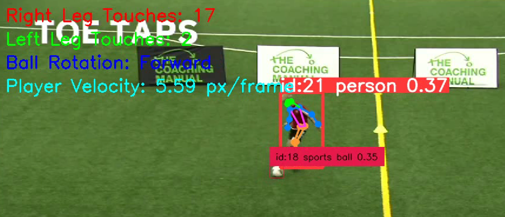

# ⚽ Player & Ball Interaction Analysis  

This project implements a **video analysis pipeline** to dynamically display metrics about player–ball interactions using **YOLOv8 (pose + object detection)** and [`supervision`](https://github.com/roboflow/supervision) utilities.  

---

## Features  

- **Touch Count per Leg**  
  - Counts how many times the ball is touched with the **right leg** and **left leg**.  

- **Ball Rotation**  
  - Detects if the ball is rotating **forward** or **backward** based on its vertical motion.  

- **Player Velocity**  
  - Estimates player’s velocity at each touch point using **hip keypoints** from pose detection.  

- **Dynamic Overlay**  
  - All metrics are drawn directly on the output video frames for real-time visualization.  

---

## Demo

